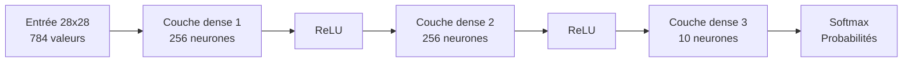

# Inférence MNIST quantifiée en C

## Contexte

Ce travail s'inscrit dans un mini-projet sur carte STM32. L'objectif global est de dessiner un chiffre sur l'écran tactile de la carte, puis de reconnaître ce chiffre à l'aide d'un réseau de neurones embarqué.

Le matériel utilisé est une Discovery kit for STM32F7 Series avec MCU STM32F746NG. Le développement est réalisé avec STM32Cube et STM32CubeIDE. Le modèle utilisé est un MLP simple, exporté et intégré directement dans le code C sous forme de tableaux statiques. L'inférence est effectuée couche par couche, sans bibliothèque de deep learning.

L'entrée du réseau attend une image `28 x 28`. Le dessin fait sur l'écran tactile est donc sous-échantillonné pour obtenir une image `28 x 28` avant l'inférence. Les pixels sont lus sur l'affichage via l'API BSP (par exemple `BSP_LCD_ReadPixel`), puis l'entrée du réseau est construite en prenant la somme des trois canaux couleur et en gardant seulement un indicateur binaire : `0` si la somme vaut `0` (noir), `1` sinon.

## Objectif

L'objectif de ce travail est de valider une chaîne d'inférence complète en C :

- lecture d'une image MNIST binaire de taille `28 x 28`
- propagation dans un réseau `784 -> 256 -> 256 -> 10`
- utilisation de poids quantifiés en `int8`
- production finale d'un vecteur de probabilités sur les 10 classes

## Structure du réseau

Le modèle utilisé suit l'architecture suivante :

```text
784 -> 256 -> 256 -> 10
```

Cette structure correspond à :

- `784` entrées, soit les `28 x 28` pixels de l'image
- une première couche cachée de `256` neurones
- une deuxième couche cachée de `256` neurones
- une couche de sortie de `10` neurones, correspondant aux chiffres de `0` à `9`

Le calcul réalisé par le réseau peut être résumé par la succession suivante :

```text
couche dense -> ReLU -> couche dense -> ReLU -> couche dense -> softmax
```

Les deux premières couches produisent donc des activations intermédiaires, tandis que la dernière couche fournit des scores bruts, ensuite convertis en probabilités à l'aide d'une fonction `softmax`.

### Schéma de l'architecture



## Principe de l'inférence

L'inférence est implémentée dans `mnist_nn.c`. Le calcul suit les étapes suivantes :

1. conversion de l'image d'entrée vers une représentation entière compatible avec la première couche
2. calcul de la première couche dense
3. application d'une ReLU quantifiée
4. calcul de la deuxième couche dense
5. application d'une deuxième ReLU quantifiée
6. calcul de la couche de sortie
7. conversion des scores de sortie vers des `float`
8. application du `softmax`

## Quantification

Afin de réduire la taille mémoire du modèle, les poids ont été quantifiés en `int8`. Les calculs intermédiaires sont en revanche accumulés en `int32`, ce qui évite une saturation trop précoce lors des sommes pondérées.

La re-quantification utilisée entre deux couches suit la forme :

```text
q = round(x * mul / 2^20)
```

où :

- `x` est la somme intermédiaire calculée en `int32`
- `mul` est un multiplicateur de re-quantification propre à la couche considérée
- `20` correspond à la constante `MNIST_MUL_SHIFT`

Après cette étape, les activations des couches cachées sont bornées entre `0` et `127`, ce qui revient à appliquer une ReLU quantifiée. On peut l'écrire en pseudo-code sous forme de cas :

```text
si q < 0    -> q_relu = 0
si q > 127  -> q_relu = 127
sinon       -> q_relu = q
```

Dans cette implémentation, l'entrée est déjà binaire. Chaque pixel de l'image vaut donc `0` ou `1`, puis est converti en une valeur entière adaptée à la première couche. La sortie finale, quant à elle, est reconvertie en `float` avant le `softmax`, afin d'obtenir un vecteur de probabilités plus lisible et directement exploitable.

## Chaîne de traitement

```mermaid
flowchart TD
  A[Dessin sur l'écran tactile] --> B[Acquisition de l'image]
  B --> C[Sous-échantillonnage<br/>28 x 28]
  C --> D[Somme des 3 canaux<br/>couleur]
  D --> E[Seulement 0 ou 1<br/>(0 = noir)]
  E --> F[Inférence MLP]
  F --> G[Vecteur de probabilités]
  G --> H[Chiffre reconnu]
```

## Origine des poids

Les poids intégrés dans `mnist_weights.h` proviennent du modèle Hugging Face [`dacorvo/mnist-mlp`](https://huggingface.co/dacorvo/mnist-mlp).

Le modèle d'origine a ensuite été exporté puis quantifié en `int8` afin d'être réutilisé dans cette implémentation C.

## Références

- [`dacorvo/mnist-mlp`](https://huggingface.co/dacorvo/mnist-mlp)
- [`modeling_mlp.py`](https://huggingface.co/dacorvo/mnist-mlp/blob/main/modeling_mlp.py)
- [`tsotchke/simple_mnist`](https://github.com/tsotchke/simple_mnist)
- [`mounirouadi/Deep-Neural-Network-in-C`](https://github.com/mounirouadi/Deep-Neural-Network-in-C)
