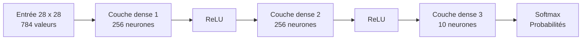
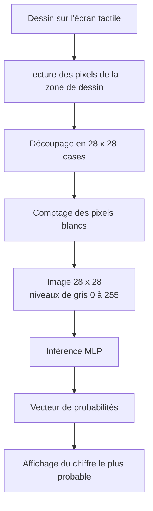

# Reconnaissance de chiffres manuscrits sur STM32F746

## Contexte

Ce travail s'inscrit dans un mini-projet réalisé sur carte **Discovery kit for STM32F7 Series** avec microcontrôleur **STM32F746NG**. L'objectif est de dessiner un chiffre directement sur l'écran tactile de la carte, puis d'effectuer sa reconnaissance à l'aide d'un réseau de neurones embarqué.

Le développement est réalisé avec **STM32Cube** et **STM32CubeIDE**. Le réseau de neurones est intégré directement dans le projet C, sans bibliothèque externe de deep learning. Les poids sont stockés dans le code sous forme de tableaux statiques quantifiés.

## Objectif

L'objectif est de mettre en œuvre une chaîne complète de reconnaissance embarquée :

- acquisition du tracé utilisateur sur l'écran tactile
- réduction de ce tracé vers une image de taille `28 x 28`
- propagation de cette image dans un réseau `784 -> 256 -> 256 -> 10`
- calcul d'un vecteur de probabilités pour les chiffres de `0` à `9`

L'application affiche ensuite ces probabilités sur la partie droite de l'écran.

## Fonctionnement sur la carte

L'écran est partagé en deux zones :

- à gauche, une zone carrée noire de taille `272 x 272` environ, utilisée pour dessiner en blanc
- à droite, une zone blanche qui affiche les probabilités calculées pour les 10 classes

Le comportement retenu est le suivant :

- tant que le doigt est posé sur l'écran, l'application dessine seulement
- lorsque le doigt est relâché, le dessin est converti en image `28 x 28`, puis l'inférence est lancée
- si l'utilisateur redessine, une nouvelle inférence est déclenchée au relâchement suivant
- le bouton `BP1` efface le dessin et la zone de texte

Dans l'implémentation actuelle, la couche 0 de l'écran contient le fond et le dessin, tandis que la couche 1 est utilisée uniquement pour l'affichage du texte.

## Structure du réseau

Le modèle utilisé est un **MLP** de la forme :

```text
784 -> 256 -> 256 -> 10
```

Cela correspond à :

- `784` entrées, soit les `28 x 28` pixels de l'image
- une première couche cachée de `256` neurones
- une deuxième couche cachée de `256` neurones
- une couche de sortie de `10` neurones

Le calcul suit la succession suivante :

```text
couche dense -> ReLU -> couche dense -> ReLU -> couche dense -> softmax
```

### Schéma de l'architecture



## Chaîne de traitement

Le tracé affiché sur l'écran n'est pas envoyé directement au réseau. Une étape de prétraitement est réalisée dans `main.c`.

Le principe est le suivant :

1. lecture des pixels dans la zone de dessin
2. découpage de cette zone en `28 x 28` cases
3. comptage du nombre de pixels blancs dans chaque case
4. conversion de chaque case en un niveau de gris entre `0` et `255`
5. passage de cette image au réseau de neurones

Autrement dit, on ne conserve pas seulement une information binaire "pixel actif / pixel inactif". On conserve un niveau de remplissage par case, ce qui permet de mieux représenter l'épaisseur locale du tracé.

### Schéma de traitement



## Principe de l'inférence

L'inférence est implémentée dans `mnist_nn.c`. Les étapes principales sont :

1. conversion de l'image `28 x 28` en entrée entière pour la première couche
2. calcul de la première couche dense
3. application d'une ReLU quantifiée
4. calcul de la deuxième couche dense
5. application d'une deuxième ReLU quantifiée
6. calcul de la couche de sortie
7. conversion des scores de sortie en `float`
8. application d'un `softmax`

La première couche n'utilise donc plus seulement un test "zéro ou non zéro". L'intensité de chaque case, comprise entre `0` et `255`, est prise en compte avant le calcul de la première couche dense.

## Quantification

Afin de limiter la taille mémoire du modèle, les poids ont été quantifiés en `int8`. Les accumulations intermédiaires sont réalisées en `int32`.

La re-quantification entre deux couches suit la forme :

```text
q = round(x * mul / 2^20)
```

où :

- `x` est la somme intermédiaire calculée en `int32`
- `mul` est un multiplicateur propre à la couche
- `20` correspond à la constante `MNIST_MUL_SHIFT`

Après cette re-quantification, les activations sont bornées entre `0` et `127`, ce qui correspond à une ReLU quantifiée :

```text
si q < 0    -> q_relu = 0
si q > 127  -> q_relu = 127
sinon       -> q_relu = q
```

Dans l'état actuel du projet, la chaîne d'entrée peut être résumée ainsi :

```text
image de l'écran -> niveau de gris 0..255 -> entrée quantifiée de la première couche
```

Plus précisément :

```text
gris_case = round(255 * nb_pixels_blancs / nb_pixels_case)
entree_q = round(gris_case * MNIST_LAYER_1_INPUT_DELTA_Q / 255)
```

On obtient ainsi une entrée plus progressive que dans une représentation strictement binaire.

## Origine des poids

Les poids intégrés dans `mnist_weights.h` proviennent du modèle Hugging Face [`dacorvo/mnist-mlp`](https://huggingface.co/dacorvo/mnist-mlp).

Le modèle d'origine a ensuite été exporté puis quantifié en `int8` afin d'être réutilisé dans cette implémentation C embarquée.

## Conclusion

Ce travail a permis de mettre en œuvre une chaîne complète de reconnaissance de chiffres manuscrits sur microcontrôleur STM32, depuis le dessin sur l'écran tactile jusqu'au calcul des probabilités de sortie du réseau. L'ensemble repose sur une implémentation en C, avec un réseau de neurones multicouche quantifié et intégré directement dans le projet.

Nous avons vu qu'une inférence de type MNIST peut être réalisée de manière embarquée sur une carte STM32F746, avec une interface utilisateur simple et un coût mémoire maîtrisé grâce à la quantification des poids. En pratique, la reconnaissance fonctionne correctement dans de nombreux cas, même si le système peut encore se tromper pour certains tracés. L'ajout d'un prétraitement fondé sur le taux de remplissage de chaque case `28 x 28` permet en outre de conserver davantage d'information sur le tracé qu'une représentation strictement binaire.


## Références

- [`dacorvo/mnist-mlp`](https://huggingface.co/dacorvo/mnist-mlp)
- [`modeling_mlp.py`](https://huggingface.co/dacorvo/mnist-mlp/blob/main/modeling_mlp.py)
- [`tsotchke/simple_mnist`](https://github.com/tsotchke/simple_mnist)
- [`mounirouadi/Deep-Neural-Network-in-C`](https://github.com/mounirouadi/Deep-Neural-Network-in-C)
